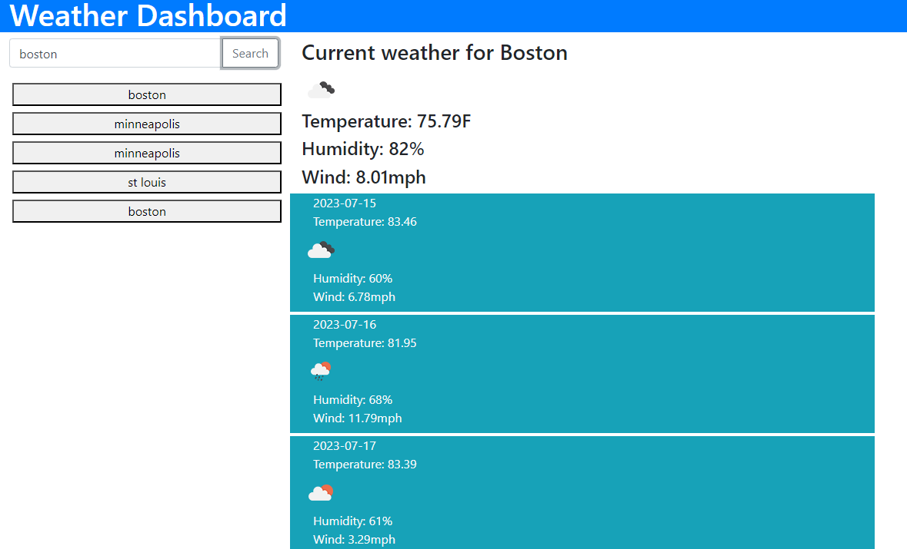

# five-day-forecast

## Description
This is a simple weather web app that allows users to check the current weather conditions and a 5-day forecast for a specific location. The app is built using HTML, Bootstrap, and jQuery, and it utilizes the OpenWeather API to retrieve weather data.

## Features

* Display the current temperature, wind speed, humidity, and weather icon.
* Show a 5-day forecast with temperature, wind speed, humidity, and weather icons.
* Responsive design using Bootstrap for improved viewing on different devices.

## Usage

* [Visit the site](https://gsr142.github.io/five-day-forecast/)
* Enter the name of a City.
* Click the Search button.
* The current weather conditions, including temperature, wind speed, humidity, and weather icon, will be displayed.
* Scroll down to view the 5-day forecast, which shows temperature, wind speed, humidity, and weather icons for each day.

## Tools Used
* [HTML](https://developer.mozilla.org/en-US/docs/Web/HTML)
* [CSS](https://developer.mozilla.org/en-US/docs/Web/CSS)
* [JavaScript](https://developer.mozilla.org/en-US/docs/Web/javascript)
* [Git](https://git-scm.com/)
* [Bootstrap](https://getbootstrap.com/)
* [Open Weather API](https://openweathermap.org/)

## Author
### Greg Richardson

## Contact
* gsr142@gmail.com
* [GitHub](https://github.com/gsr142)
* [LinkedIn](https://www.linkedin.com/in/gregory-richardson-7bb3a1280/)
